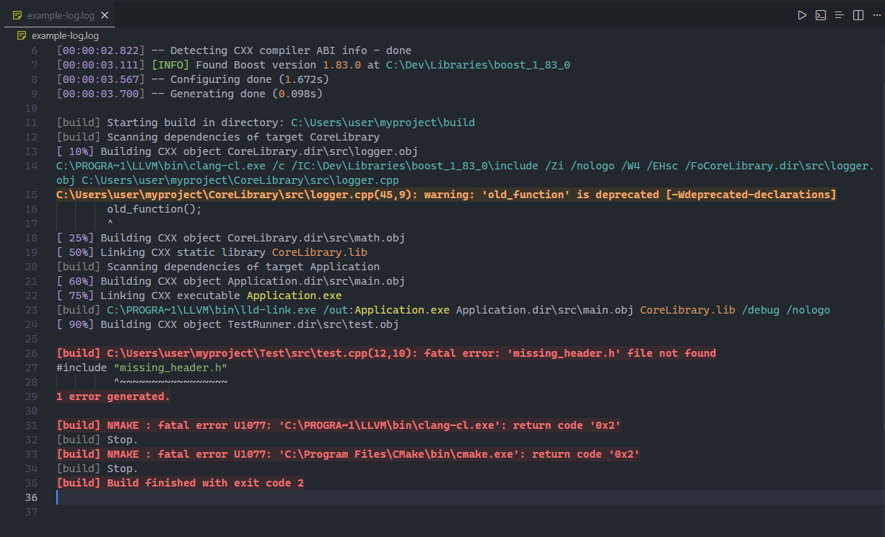
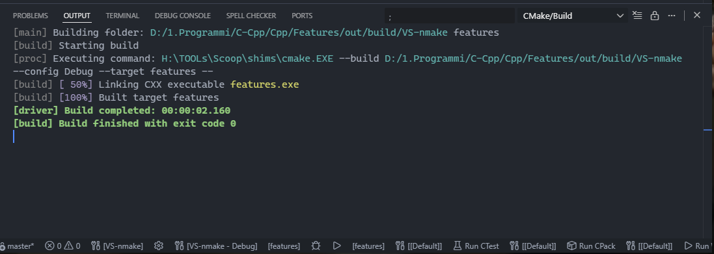
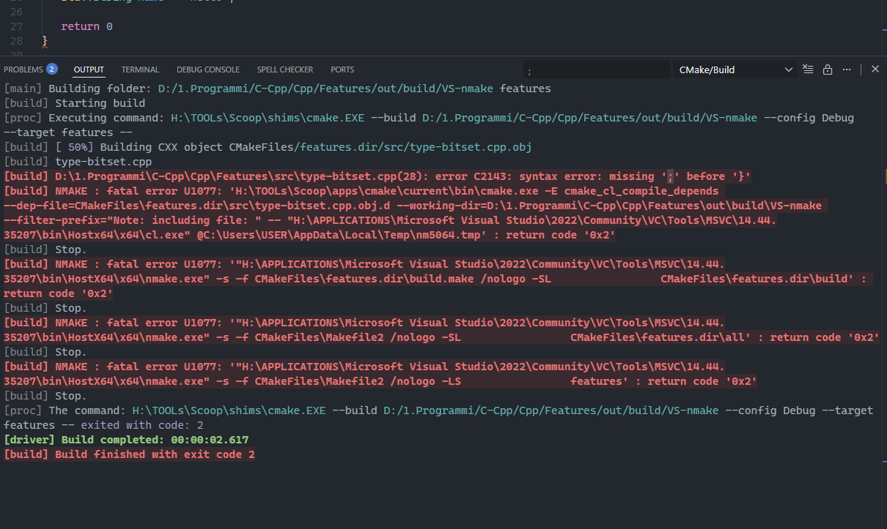

# CMake Output Colouriser

[](https://marketplace.visualstudio.com/items?itemName=alec269.cmake-output-colouriser)
[](https://marketplace.visualstudio.com/items?itemName=alec269.cmake-output-colouriser)
[](LICENSE.md)

Adds intelligent syntax highlighting and **colourisation** to CMake build output and logs for enhanced readability. Quickly spot **Errors**, **Warnings**, **Successes**, and other key information directly in your VS Code output panes.

## ✨ Features

* **Error Highlighting:** Highlights entire lines **containing** keywords like `error`, `failed`, `fatal`, and `exception` in **bright red** with a subtle background.
* **Warning Highlighting:** Highlights lines with `warning` or `warn` in **bright orange/yellow**.
* **Success Indicators:** Highlights successful build messages, especially `Build finished with exit code 0` or `Build completed`, in **bright green**.
* **Contextual Highlighting:**
  * ***File Paths:*** **Colours** Windows and Unix file paths distinctly (e.g.,`C:\path\to\file`, `/path/to/file`).
* **Commands/Executables:** Highlights executables like `.exe` files ( only works with `make` and `nmake` ).
* **Timestamps & Percentages:** **Colours** build progress indicators (`[ 50%]`) and timestamps (`HH:MM:SS`) for easy tracking.
* **Real-time Decoration:** Automatically **colourises** output as it appears in the active **editor** or output pane.

## 🚀 Usage

The **extension** is designed to work automatically in any editor or output panel that is recognised as **containing** log output, specifically targeting CMake and build-related log messages.

1. **Install** the **extension** from the VS Code Marketplace.
2. Open your **CMake Output Channel** or a log file (`.log` file with `log` language ID).
3. The **colourisation** will be applied instantly.

The **extension** attempts to identify CMake output using broad **heuristics** (`editor.document.uri.scheme === 'output'`, URI/title contains 'CMake' or 'Build', or `languageId` is 'log').

## Notice

This **extension** has only been tested with **Microsoft CMake Tools** **extension**.  
**Extension** **id**: `ms-vscode.cmake-tools`

-----

## 🖼️ Examples

Here is how the **extension** transforms raw build output into an easy-to-read log, demonstrating success, failure, and granular highlighting.

### Log File

A **comprehensive** example showing **configuration** messages, progress, warnings, and path highlighting.

  

### Successful Build

Highlighting for a clean build completion message.

  

### Build Error/Failure

Clear highlighting for fatal errors and failed exit **codes**.  

  

-----

## ⚙️ **Configuration**

You can manage the **extension's** **behaviour** in your VS Code settings (`settings.json`):

| Setting | Type | Default | Description |
| :--- | :--- | :--- | :--- |
| `cmakeColorizer.enable` | `boolean` | `true` | Globally enable or disable the CMake output **colourisation**. |

### **Customisation** **of** **Colours**

**Currently**, **customisation** is not implemented.

## 🛠 Building the Project

If you want to modify and build the **extension** yourself:

1. Clone the **repository**:

<!-- end list -->

```sh
git clone --depth 1 https://github.com/Alec269/cmake-output-colouriser.git     
cd cmake-output-colouriser
```

2. Install **dependencies**:

<!-- end list -->

```bash
npm install
```

3. Compile the TypeScript **code**:

<!-- end list -->

```bash
npm run compile
```

4. Run from VS Code: Press **F5** in VS Code to launch a new **Extension** Development Host window with the **extension** loaded.

## 📝 License

This project is licensed under the **MIT License**.
